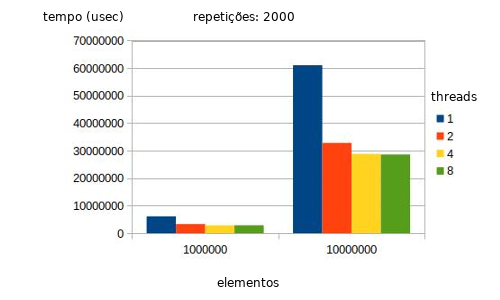
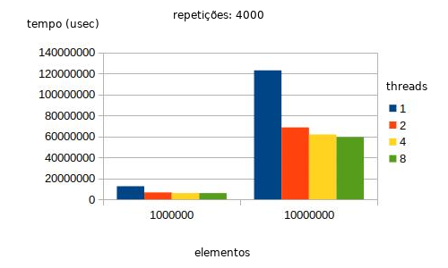
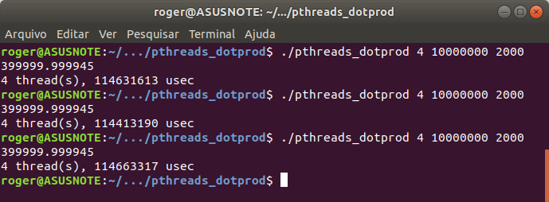
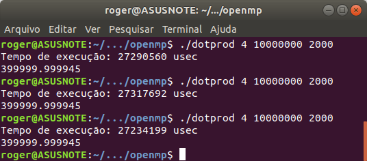
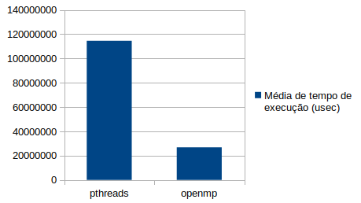

[Programação Paralela](https://github.com/AndreaInfUFSM/elc139-2018a) > Trabalhos

# T3: Programação Paralela Multithread

Disciplina: ELC139 - Programação Paralela  
Aluno: Roger Eduardo de Couto

## Sumário

- [Parte 1](#parte-1)
	- [Questão 1](##questao-1)
         - [Particionamento](###particionamento)
         - [Comunicação](###comunicacao)
         - [Aglomeração](###aglomeracao)
         - [Mapeamento](###mapeamento)
	- [Questão 2](##questao-2)
    - [Questão 3-4](##questao-3-4)
        - [Testes e Resultados](###testes-res)
    - [Questão 5](##questao-5)
- [Parte 2](#parte-2)
	- [Implementação OpenMP](##implementacao)
- [Referências](#referencias)

# Parte 1

## Questão 1

1. Explique como se encontram implementadas as 4 etapas de projeto: particionamento, comunicação, aglomeração, mapeamento (use trechos de código para ilustrar a explicação).

### Particionamento:

 Nesta linha de código são criadas threads dividindo o a multipicação, assim a função dotprod_worker pode ocorrer mais de uma vez 

 pthread_create(&threads[i], &attr, dotprod_worker, (void *) i);
 

### Comunicação:

 A comunicação é feita por memória compartilhada, porém é utilizado um semáforo para controle de dependências, pois a escrita da soma deve ocorrer após a multiplicação.

### Aglomeração

A as partes do vetor que são calculadas pelas threads são sempre próximas, isso otimiza o processo.
Por exemplo, em um vetor com 8 elementos e 2 threads com índices de 0 a 7, o programa vai dividir em 2 partes e fazer o cálculo em paralelo entre os índices 0 até 3 e de 4 até 7.

long offset = (long) arg; 

isso indica qual locar do vetor a função dotprod_worker deve começar a calcular

### Mapeamento

wsize = atoi(argv[2]);  // worksize = tamanho do vetor de cada thread

Além do offset usado pela função dotprod_worker pra saber qual índice do vetor ele deve começar a calcular, essa variável mostra qual o número de elementos que cada thread deve calcular

## Questão 2

2. Considerando o tempo (em segundos) mostrado na saída do programa, qual foi a aceleração com o uso de threads?

O tempo caiu quase pela metade
1 thread(s): 6141209 usec
2 thread(s), 3298293 usec
Aceleração de 46,3 %

## Questão 3-4

3. A aceleração (speedup) se sustenta para outros tamanhos de vetores, números de threads e repetições? Para responder a essa questão, você terá que realizar diversas execuções, variando o tamanho do problema (tamanho dos vetores e número de repetições) e o número de threads (1, 2, 4, 8..., dependendo do número de núcleos). Cada caso deve ser executado várias vezes, para depois calcular-se um tempo de processamento médio para cada caso. Atenção aos fatores que podem interferir na confiabilidade da medição: uso compartilhado do computador, tempos muito pequenos, etc.

### Testes e resultados

Foram feitos testes com 1,2,4, e 8 threads, 1000000 e 10000000 elementos e 2000 e 4000 repetições
Os gráficos com os resultados se encontram abaixo:

Pode se perceber que a diferença entre 1 e 2 threads é bem grande para todos os casos, bem como era esperado já que o processador usado tem apenas 2 núcleos, porém um pequeno aumento de desempenho é notado utilizando 4 threads, visto que o processador tem 2 unidades funcionais para cada núcleo (Hyper threading), a partir disso o ganho de desempenho é irrelevante.

## Questão 5

Explique as diferenças entre [pthreads_dotprod.c](pthreads_dotprod/pthreads_dotprod.c) e [pthreads_dotprod2.c](pthreads_dotprod/pthreads_dotprod2.c). Com as linhas removidas, o programa está correto? 

As linhas removidas removem o controle por semáforo da variável que acumula a soma, mesmo assim o programa executa e o resultado continua correto, devido ao fato dessa variável apesar de ser acessada por todas as threads apenas acumular os resultados das multiplicações, se as multiplicações dependessem do valor que estava contido nelas aí sim causaria um erro no cálculo.

# Parte 2

## Implementação OpenMP

Após a implementação do código em ./openmp/openmp_dotprod.c, que foi basicamente uma reformulação do código de pthreads_dotprod para utilizar a biblioteca OpenMP, deu pra perceber um aumento significativo no desempenho, para os testes foi padronizado o número de threads que tinha o melhor desempenho no teste anterior (4 threads), bem como o tamanho do vetor de 10000000 e 2000 repetições que leva um tempo adequado para o benchmark:

Usando pthreads:

Usando openmp:

Pode se notar um aumento grande no desempenho usando openmp
Gráfico comparando:

Foi feito um teste de quantidade de operações totais realizadas para confirmar que o programa feito com openMP não estava fazendo menos repetições que deveria, mas o contador em ambos chegou ao mesmo número.

# Referências

Tutorial OpenMP: https://www.ibm.com/developerworks/br/aix/library/au-aix-openmp-framework/index.html

